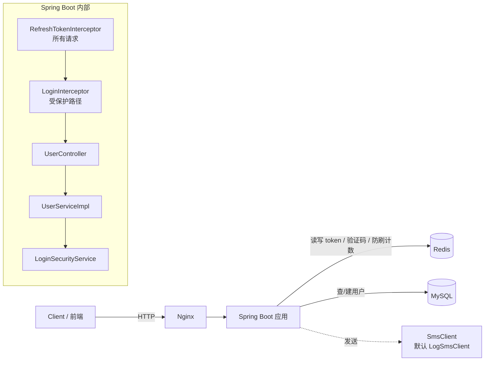
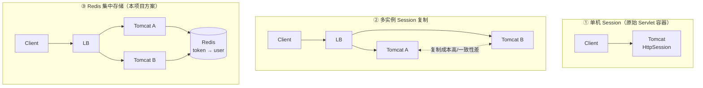
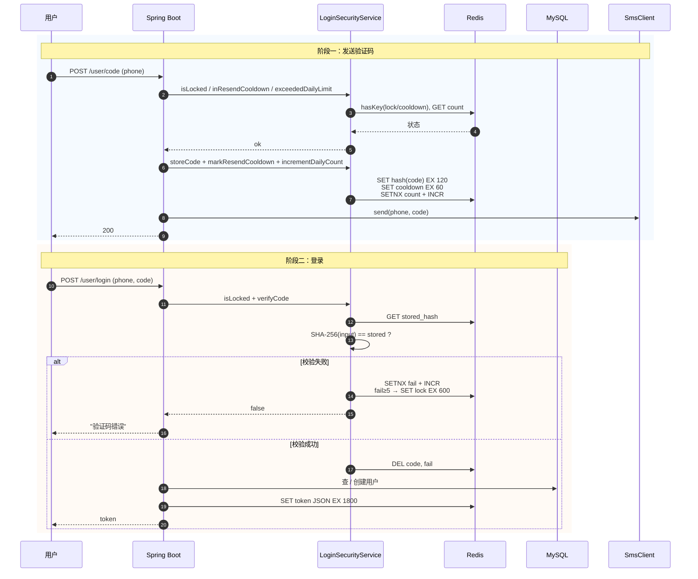
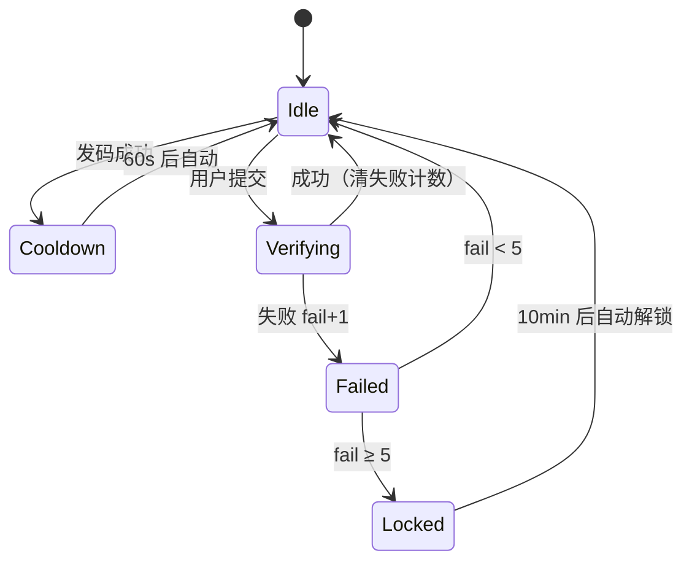
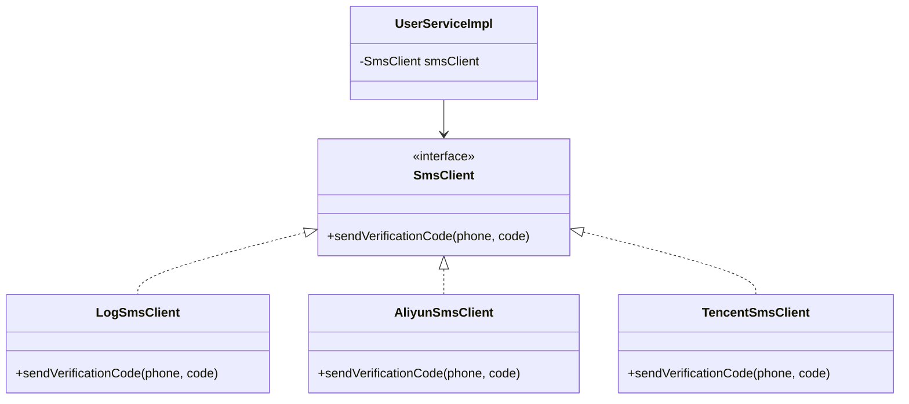
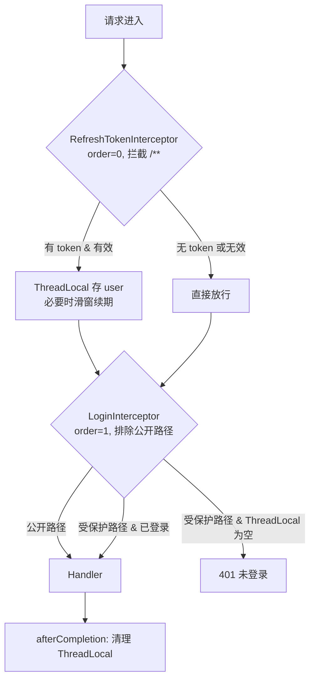
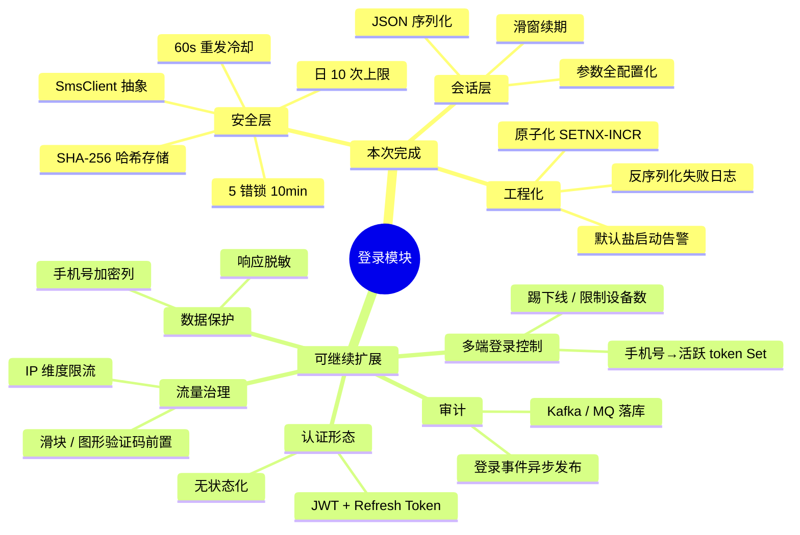

# 黑马点评 · 登录模块（企业化改造版）讲解

> 受众：技术答辩 / 面试讲解
> 项目：hm-dianping (Spring Boot 2.7 + Redis + MyBatis-Plus)
> 关键变化：从 toy 实现 → 中小企业可用版本
> 配套代码：`src/main/java/com/hmdp/`，tag `refactor/login-enterprise`

---

## 目录

1. [模块全景](#1-模块全景)
2. [原版本的 6 个 "Toy 味" 问题](#2-原版本的-6-个-toy-味-问题)
3. [方案演进：Session → Redis Token](#3-方案演进session--redis-token)
4. [改造后的主流程时序图](#4-改造后的主流程时序图)
5. [安全层 ①：防刷 + 哈希 + 锁定](#5-安全层-防刷--哈希--锁定)
6. [安全层 ②：SmsClient 抽象](#6-安全层-smsclient-抽象)
7. [会话改造 ①：JSON 替代 Hash](#7-会话改造-json-替代-hash)
8. [会话改造 ②：滑窗续期](#8-会话改造-滑窗续期)
9. [双拦截器设计](#9-双拦截器设计)
10. [关键代码 Diff 速览](#10-关键代码-diff-速览)
11. [总结 & 可继续扩展方向](#11-总结--可继续扩展方向)

---

## 1. 模块全景



**职责切分**：

| 组件 | 职责 |
|---|---|
| `RefreshTokenInterceptor` | 所有请求都经过；解析 token、把 user 写入 ThreadLocal、临近过期才续 TTL |
| `LoginInterceptor` | 仅在受保护路径生效；ThreadLocal 没有 user 就 401 |
| `UserServiceImpl` | 业务编排，不感知 Redis 细节 |
| `LoginSecurityService` | 防刷（冷却/日上限）+ 哈希存取验证码 + 错误锁定 |
| `SmsClient` | 短信发送抽象（默认 `LogSmsClient`，生产换阿里云/腾讯云仅需新增实现） |
| `LoginProperties` | 所有 TTL / 阈值 / 上限 / 盐 集中配置 |

---

## 2. 原版本的 6 个 "Toy 味" 问题

| # | 问题 | 真实代价 |
|---|---|---|
| ① | **同手机号可无限刷验证码**（无 60s 间隔，无日上限） | 一夜烧光短信费 |
| ② | **验证码明文存 Redis** | Redis 一旦泄露 = 验证码全裸 |
| ③ | **验证码错误次数无限** | 6 位数字暴力枚举可破 |
| ④ | **短信发送写死 `log.debug`** | 永远接不上真实服务商 |
| ⑤ | **Token 续期每次请求都写 Redis** | 写放大、热 key 风险 |
| ⑥ | **用户信息用 Hash 存**，字段全转 String | 类型丢失，DTO 转换需要反射"猜"类型 |

> 这 6 个点，企业里任何一个都会被 review 打回。

---

## 3. 方案演进：Session → Redis Token



| 方案 | 扩展性 | 一致性 | 实现成本 |
|---|---|---|---|
| ① 单机 Session | ❌ 无法水平扩 | ✅ 天然一致 | 极低 |
| ② Session 复制 | 🟡 只到小集群 | 🟡 复制延迟 | 中 |
| ③ Redis 集中 | ✅ 应用无状态 | ✅ 单源 | 低（中间件已有） |

**结论**：状态外置到 Redis，应用本身无状态，水平扩展无压力。

---

## 4. 改造后的主流程时序图



**关键改动点**（黄色阶段）：
- 校验失败也会被反向记账（INCR fail），达到阈值锁定。
- 任何状态写入都带 TTL（`SET ... EX` 或先 `SETNX EX` 再 `INCR`），不存在"无 TTL 的 Redis 垃圾 Key"。

---

## 5. 安全层 ①：防刷 + 哈希 + 锁定

### 三道闸门

| 闸门 | Redis Key | 触发条件 | 动作 |
|---|---|---|---|
| 冷却 | `login:code:cooldown:{phone}` | 60s 内重发同号 | 拒绝 |
| 日上限 | `login:code:count:{phone}` (TTL 24h) | 单号 ≥ 10 次/日 | 拒绝 |
| 锁定 | `login:code:lock:{phone}` (TTL 10min) | 单号连错 ≥ 5 次 | 期间发码/登录都拒 |

### 状态机



### 哈希存储

Redis 中存 `SHA-256(phone + ":" + code + ":" + salt)`，盐取自 `hmdp.login.code-salt`：

```java
private String hash(String phone, String rawCode) {
    MessageDigest md = MessageDigest.getInstance("SHA-256");
    byte[] bytes = md.digest((phone + ":" + rawCode + ":" + props.getCodeSalt())
            .getBytes(StandardCharsets.UTF_8));
    // 转 hex...
}
```

**为什么够用**：
- 即便 Redis 被脱库，攻击者拿不到原始 code。
- 加盐 → 同一 code 在不同号码下哈希值不同，无法用全局彩虹表。
- 启动时如检测到默认盐会打 `WARN` 日志，提醒生产环境必须改。

### 原子化 TTL（避免无 TTL 的孤儿计数）

❌ 错误模式（INCR 后再 EXPIRE，中间崩溃 → 计数永不过期）：

```java
Long v = redis.opsForValue().increment(key);
if (v == 1L) redis.expire(key, 24, HOURS);   // 崩溃窗口
```

✅ 改造后（SETNX 先占位带 TTL，再 INCR）：

```java
redis.opsForValue().setIfAbsent(key, "0", 24, TimeUnit.HOURS);
redis.opsForValue().increment(key);
```

> 这个改动来自 code review，是面试点："你怎么保证 Redis 计数 key 不会泄漏成为僵尸？"

---

## 6. 安全层 ②：SmsClient 抽象



**为什么必须抽象**：

- 原版 `log.debug` 直接写在 `UserServiceImpl` 里，永远上不了生产。
- 不同环境需要不同实现：日志（dev）/ 阿里云（prod）/ Mock（test）。
- **替换实现 → `UserServiceImpl` 零改动**，依赖反转的教科书例子。

新增阿里云实现示意：

```java
@Component
@ConditionalOnProperty(name = "hmdp.sms.provider", havingValue = "aliyun")
public class AliyunSmsClient implements SmsClient {
    public void sendVerificationCode(String phone, String code) {
        // 调用阿里云 SDK
    }
}
```

---

## 7. 会话改造 ①：JSON 替代 Hash

| 维度 | Hash（原版） | JSON String（改造后） |
|---|---|---|
| 读写命令 | `HSET` / `HGETALL`，多 field 往返 | `SET` / `GET`，一次完成 |
| 类型保真 | ❌ 所有值转 String，`Long → "123"` | ✅ Jackson 反序列化还原 |
| 反序列化代码 | `BeanUtil.fillBeanWithMap`，依赖反射猜类型 | `objectMapper.readValue`，类型明确 |
| 部分字段更新 | ✅ 支持 `HSET` 单字段 | ❌ 整体 GET → 改 → SET |
| 调试可读性 | `HGETALL` 多行字段 | ✅ `GET` 一行 JSON 一目了然 |

**取舍**：登录态字段总量小（id / nickName / icon），都是**整体读写**，没有"只改一个字段"的场景。JSON 更合适。

**改造前**：

```java
Map<String, Object> userMap = BeanUtil.beanToMap(userDTO, new HashMap<>(),
        CopyOptions.create().setIgnoreNullValue(true)
                .setFieldValueEditor((fieldName, fieldValue) -> fieldValue.toString()));
stringRedisTemplate.opsForHash().putAll(LOGIN_USER_KEY + token, userMap);
stringRedisTemplate.expire(LOGIN_USER_KEY + token, LOGIN_USER_TTL, TimeUnit.MINUTES);
```

**改造后**：

```java
String json = objectMapper.writeValueAsString(userDTO);
stringRedisTemplate.opsForValue().set(
        LOGIN_USER_KEY + token, json,
        props.getTokenTtlSeconds(), TimeUnit.SECONDS);
```

读侧从 `HGETALL → fillBeanWithMap` 简化为 `GET → readValue`，少一次反射、多一份类型安全。

---

## 8. 会话改造 ②：滑窗续期

### 原版问题

每次请求都执行 `EXPIRE`。活跃用户每秒 N 个请求 = 每秒 N 次 Redis 写。Token Key 高频成为热 key。

### 改造方案

读 token 后先看剩余 TTL，仅当 **剩余 < 阈值（默认 600s）** 才续。

```java
Long ttl = stringRedisTemplate.getExpire(key, TimeUnit.SECONDS);
if (ttl != null && ttl > 0 && ttl < props.getRefreshThresholdSeconds()) {
    stringRedisTemplate.expire(key, props.getTokenTtlSeconds(), TimeUnit.SECONDS);
}
```

### 写入次数对比（30 分钟 TTL，600s 阈值）

```mermaid
gantt
  title 单 token 在 30 分钟窗口内的 Redis 写次数
  dateFormat X
  axisFormat %s 分钟

  section 原版（每请求都续）
  写: 0, 5
  写: 5, 5
  写: 10, 5
  写: 15, 5
  写: 20, 5
  写: 25, 5

  section 改造（仅临近过期续）
  跳过: 0, 5
  跳过: 5, 5
  跳过: 10, 5
  跳过: 15, 5
  跳过: 20, 5
  写  : 25, 5
```



**面试点**：你为什么敢"少写"？因为：
- 阈值 = 600s 远大于"用户两次请求间隔"，不会因为没续期而误踢。
- TTL 还剩 > 600s 时，业务上完全没必要续，纯属冗余。

---

## 9. 双拦截器设计



### 为什么必须拆成两个？

| 关注点 | 范围 | 责任拦截器 |
|---|---|---|
| 续期 token / 把 user 放进 ThreadLocal | **所有请求**（哪怕访问公开页面也要续期） | RefreshTokenInterceptor |
| 拦截未登录请求返回 401 | **仅受保护路径** | LoginInterceptor |

如果合并为一个拦截器：
- 排除规则会互相打架：公开路径要执行续期但不要 401，写在一处会变得很扭曲。
- 想加一个新中间件（比如审计），又得复制路径配置。

**单一职责** + **顺序控制（order）** = 干净的责任链。

### 公开路径配置（已迁出常量）

```java
private static final String[] PUBLIC_PATHS = {
    "/user/code", "/user/login", "/blog/hot",
    "/shop/**", "/shop-type/**", "/upload/**", "/voucher/**"
};
```

新增公开路径只改一处，不用翻拦截器源码。

---

## 10. 关键代码 Diff 速览

完整 diff 见 `docs/login-module-deck/diffs/`。

### `UserServiceImpl#sendCode` 关键差异

```diff
- if (RegexUtils.isPhoneInvalid(phone)) return Result.fail("手机号格式错误");
- String code = RandomUtil.randomNumbers(6);
- stringRedisTemplate.opsForValue().set(LOGIN_CODE_KEY + phone, code, 2, MINUTES);
- log.debug("发送短信验证码成功，验证码：{}", code);
- return Result.ok();

+ if (RegexUtils.isPhoneInvalid(phone)) return Result.fail("手机号格式错误");
+ if (security.isLocked(phone))         return Result.fail("操作过于频繁，请稍后再试");
+ if (security.inResendCooldown(phone)) return Result.fail("发送过于频繁，请稍后再试");
+ if (security.exceededDailyLimit(phone)) return Result.fail("今日发送次数已达上限");
+
+ String code = RandomUtil.randomNumbers(6);
+ security.storeCode(phone, code);              // 存 SHA-256 而非明文
+ security.markResendCooldown(phone);
+ security.incrementDailyCount(phone);
+ smsClient.sendVerificationCode(phone, code);  // 抽象出去的发送
+ return Result.ok();
```

### `RefreshTokenInterceptor` 关键差异

```diff
- Map<Object, Object> userMap = stringRedisTemplate.opsForHash().entries(key);
- if (userMap.isEmpty()) return true;
- UserDTO userDTO = BeanUtil.fillBeanWithMap(userMap, new UserDTO(), false);
- UserHolder.saveUser(userDTO);
- stringRedisTemplate.expire(key, LOGIN_USER_TTL, TimeUnit.MINUTES);   // 每次都续
- return true;

+ String json = stringRedisTemplate.opsForValue().get(key);
+ if (json == null || json.isEmpty()) return true;
+ UserDTO userDTO;
+ try {
+     userDTO = objectMapper.readValue(json, UserDTO.class);
+ } catch (Exception e) {
+     log.warn("failed to deserialize login token, key={}, err={}", key, e.getMessage());
+     return true;
+ }
+ UserHolder.saveUser(userDTO);
+ Long ttl = stringRedisTemplate.getExpire(key, TimeUnit.SECONDS);
+ if (ttl != null && ttl > 0 && ttl < props.getRefreshThresholdSeconds()) {
+     stringRedisTemplate.expire(key, props.getTokenTtlSeconds(), TimeUnit.SECONDS);
+ }
+ return true;
```

---

## 11. 总结 & 可继续扩展方向



# Key Points

7. ### JWT vs Redis Token

   黑马: Token是一个无意义的UUID, 用户信息存在 Redis里.

   JWT: Token本身包含用户信息, 服务端不存任何东西.

   ​	JWT token: Header算法信息; Payload用户信息,base64明文; Signaature签名

   JWT原理: 服务端有一个密钥, 签发时 Signature = HMAC-SHA256; 验证时用同样的方法重算一遍, 和token里的signature对比, 一致就读取用户信息, 不一致就拒绝. 验证过程完全在本地, 不需要Redis和数据库.

---

> **附**：本文配套的代码改造在 `tag refactor/login-enterprise`，可通过 `git diff <baseline>..refactor/login-enterprise -- src/main/java/com/hmdp/` 查看完整变更。
